# INQA MWF Ticketing & Deflection — Flow Spec (platform-agnostic)

> The platform (Slack-native / **Linear** / Airtable) is **not yet chosen** — these flows are written as roles, so the same flow drops onto whichever platform we pick. Lock the flows now; lock the platform later.

---

## The six roles (how a flow maps to a platform)

| Role | What it does | Slack-native | **Linear-centric (lean)** | Airtable-backed |
|------|--------------|--------------|---------------------------|-----------------|
| **Intake** | CB raises issue | Slack msg / shortcut / slash cmd | Slack → Linear issue | Slack/form → Airtable |
| **Triage brain** | LLM classify + enrich via tools | Claude agent on Vercel | Claude agent on Linear webhook / orchestrator | Claude agent on Vercel |
| **Tool layer** | reads + low-risk writes | `resolve_cbs`, Redash, Compass tag dispatch — **identical everywhere** | same | same |
| **Board / work queue** | human + batch tickets, status | Airtable | **Linear** | Airtable |
| **Owner routing** | category → person/team | Slack groups | Linear team/assignee | Airtable owner field |
| **Notifier** | status back to CB | Slack thread/DM | Linear→Slack sync | Slack via API |

**Tool layer already exists in this repo** (the part that makes any platform viable):
- `lib/handlers/resolveCbs.ts` — **keyless READ**: `workerSource`, `workerStatus`, `currentWorkerTeam`, `hasRemovedMwfTag` (account + allocation + TnS-proxy in one call).
- `lib/redash.ts` — Redash runner (EQ / course / allocation / leave / strike). *Gotcha: query keys can't job-poll → re-POST `/results` with `max_age`.*
- `lib/handlers/applyTag.ts` + Compass keyless dispatch sheet — low-risk writes (course reset, leave, notice tags) **without a Scale cookie**.
- Cookie-backed writes (`add/remove_worker_source`) stay fully human-gated (Tier D).

---

## Routing tiers

| Tier | Meaning | Human? | Writes? |
|------|---------|--------|---------|
| **A** | Instant read-only answer | No | No |
| **B** | Answer + one-click approve | One tap to commit | Low-risk only, after tap |
| **C** | Batch bucket → bulk-resolve → fan-out | Team, in bulk | Bulk action |
| **D** | Escalate to a named owner; CB gets a guarded holding message | Yes | Human-performed |

---

## Ticket taxonomy (from 3,862 historical tickets)

| Category | Hist. % | Tier | Resolution shape | Flow |
|----------|--------:|------|------------------|------|
| EQ / allocation (+ move-to-marketplace) | ~17.5%, ~50–60% incl. "Others" | **C** | bucket → bulk-resolve → fan-out | C1 |
| Course reset | 17.0% | **B** | verify → approve → reset tag | B1 |
| Tier upgrade (T2→T3) | 6.2% | **B** | verify tenure/hrs/QMS → approve | B2 |
| Skills check / how-to-add | 5.0% | **A** | read skills → inform + guide to screening (no write) | A5 |
| Leave / pause (+ early return) | 2.3% | **B** | policy check → tag dispatch (auto if clean) | B3, B4 |
| TnS / account suspended | 2.4% | **D** | shield reason → route to Arbaz → decision | D1 |
| Task availability check | 2.0% | **A** | read → answer | A1 |
| Strike / notice status & appeal | in "Others" | **A** / D | read → answer; appeal → CSM | A3 |
| Account verification / access | 0.6% | **D** | status → route to Support | D2 |
| Glitch / bug / data issue | in "Others" | **D** | capture → route to Eng | D3 |
| Pay / rate / policy question | in "Others" | **A** | KB answer | A4 |
| Re-onboarding ("can I rejoin?") | in "Others" | **A/D** | status → guide or route | D4 |
| **Others / unclassified** | 46.9% | classifier | LLM re-classify → above | CLS |

**Owner map (confirm handles):** TnS = **Arbaz** · EQ/allocation/marketplace = **Allocation team** · course/tier = **Ops/CSM** · glitch = **Engineering** · access = **Support**.

---

## Canonical flow (every ticket inherits this spine)

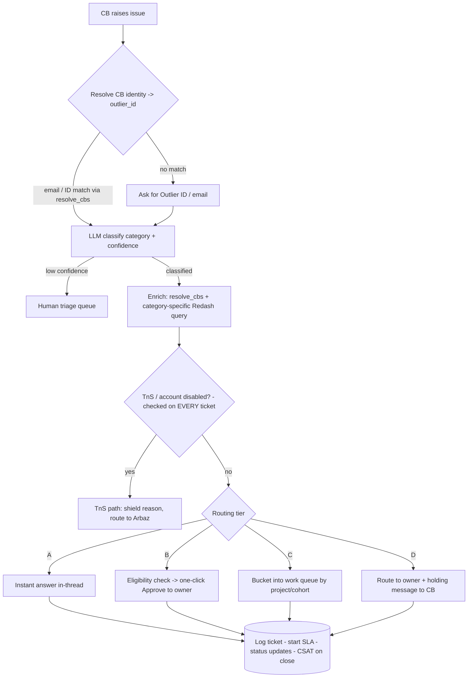
```mermaid
flowchart TD
  A[CB raises issue] --> B{Resolve CB identity -> outlier_id}
  B -->|email / ID match via resolve_cbs| C[LLM classify category + confidence]
  B -->|no match| B1[Ask for Outlier ID / email] --> C
  C -->|low confidence| H[Human triage queue]
  C -->|classified| D["Enrich: resolve_cbs + category-specific Redash query"]
  D --> E{TnS / account disabled? - checked on EVERY ticket}
  E -->|yes| T[TnS path: shield reason, route to Arbaz]
  E -->|no| F{Routing tier}
  F -->|A| G[Instant answer in-thread]
  F -->|B| I[Eligibility check -> one-click Approve to owner]
  F -->|C| J[Bucket into work queue by project/cohort]
  F -->|D| K["Route to owner + holding message to CB"]
  G --> Z[(Log ticket - start SLA - status updates - CSAT on close)]
  I --> Z
  J --> Z
  K --> Z
```

> **Invariant:** the TnS/account-disabled check runs **before any reply, on every flow**. A flagged CB never receives state detail — only the generic TnS holding message.

---

## A — Instant answer (read-only)

### A1 · Task availability check
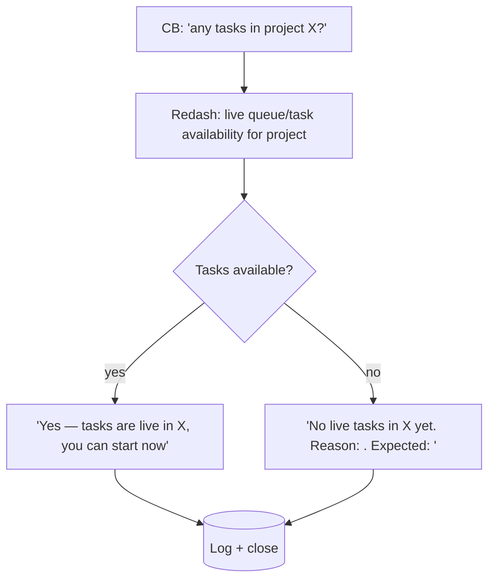
```mermaid
flowchart TD
  A[CB: 'any tasks in project X?'] --> B[Redash: live queue/task availability for project]
  B --> C{Tasks available?}
  C -->|yes| D["'Yes — tasks are live in X, you can start now'"]
  C -->|no| E["'No live tasks in X yet. Reason: <paused / pre-qual>. Expected: <window>'"]
  D --> Z[(Log + close)]
  E --> Z
```

### A2 · Account / allocation / tier status
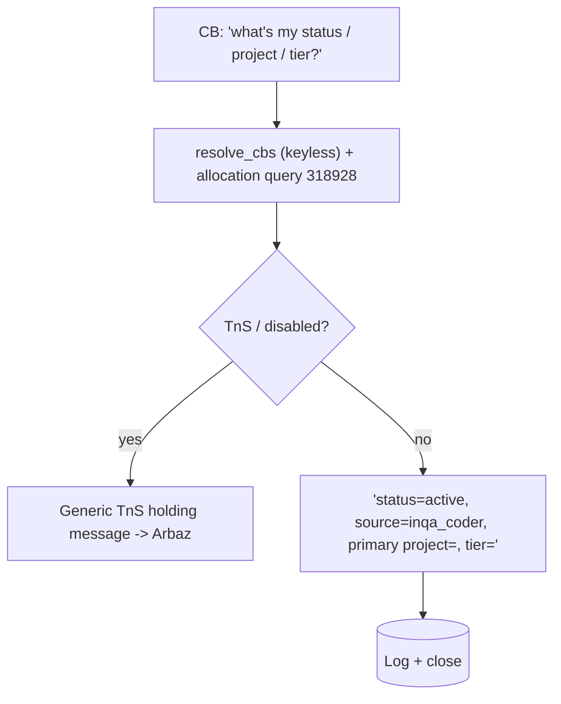
```mermaid
flowchart TD
  A[CB: 'what's my status / project / tier?'] --> B["resolve_cbs (keyless) + allocation query 318928"]
  B --> C{TnS / disabled?}
  C -->|yes| T[Generic TnS holding message -> Arbaz]
  C -->|no| D["'status=active, source=inqa_coder, primary project=<X>, tier=<T2/T3>'"]
  D --> Z[(Log + close)]
```

### A3 · Strike / notice / cooldown status
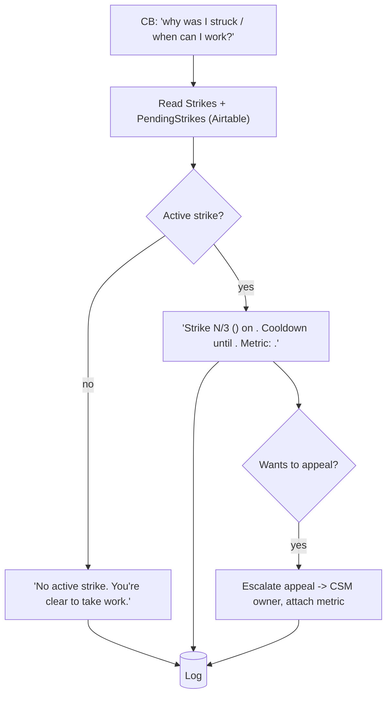
```mermaid
flowchart TD
  A[CB: 'why was I struck / when can I work?'] --> B["Read Strikes + PendingStrikes (Airtable)"]
  B --> C{Active strike?}
  C -->|no| D["'No active strike. You're clear to take work.'"]
  C -->|yes| E["'Strike N/3 (<hrs/qual/course>) on <date>. Cooldown until <date>. Metric: <value vs threshold>.'"]
  E --> F{Wants to appeal?}
  F -->|yes| G[Escalate appeal -> CSM owner, attach metric]
  D --> Z[(Log)]
  E --> Z
  G --> Z
```

### A4 · Pay / policy / FAQ
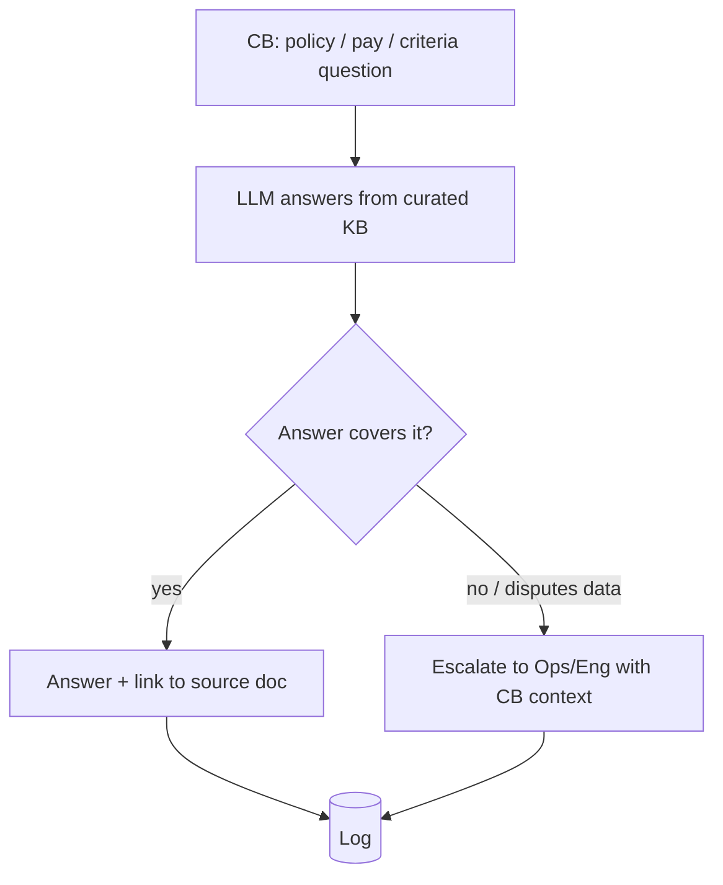
```mermaid
flowchart TD
  A[CB: policy / pay / criteria question] --> B[LLM answers from curated KB]
  B --> C{Answer covers it?}
  C -->|yes| D[Answer + link to source doc]
  C -->|no / disputes data| E[Escalate to Ops/Eng with CB context]
  D --> Z[(Log)]
  E --> Z
```

### A5 · Skills check / how to add a skill  *(read-only — no profile writes)*
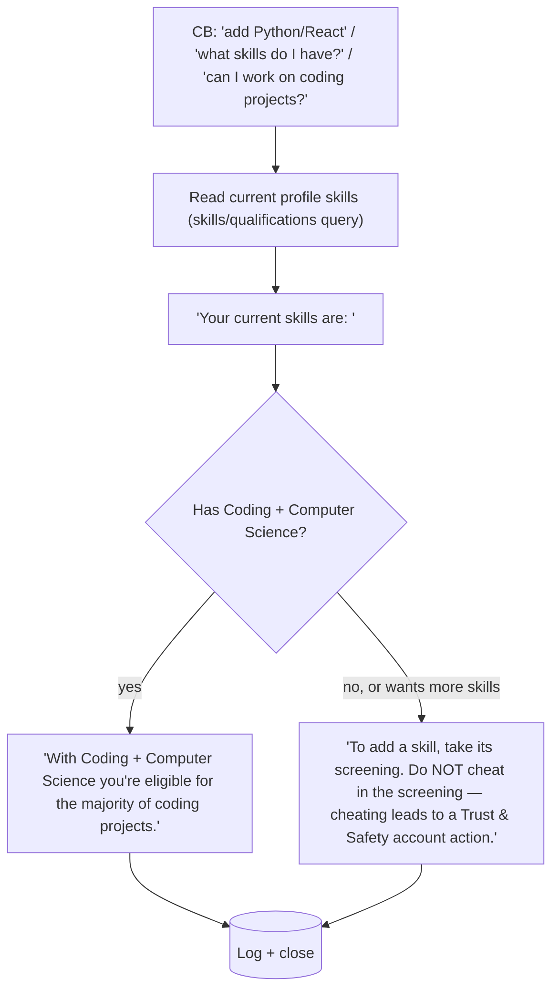
```mermaid
flowchart TD
  A["CB: 'add Python/React' / 'what skills do I have?' / 'can I work on coding projects?'"] --> B["Read current profile skills (skills/qualifications query)"]
  B --> C["'Your current skills are: <list>'"]
  C --> D{Has Coding + Computer Science?}
  D -->|yes| E["'With Coding + Computer Science you're eligible for the majority of coding projects.'"]
  D -->|no, or wants more skills| F["'To add a skill, take its screening. Do NOT cheat in the screening — cheating leads to a Trust & Safety account action.'"]
  E --> Z[(Log + close)]
  F --> Z
```
> **Copy intent:** the bot never edits the profile — it *informs* (current skills), *reassures* (Coding + Computer Science → most coding projects), and *redirects* (take screening to add skills, with the anti-cheat warning, since screening-cheating is a top TnS offense).

---

## B — Answer + one-click approve

### B1 · Course reset  *(~17% — highest single actionable category)*
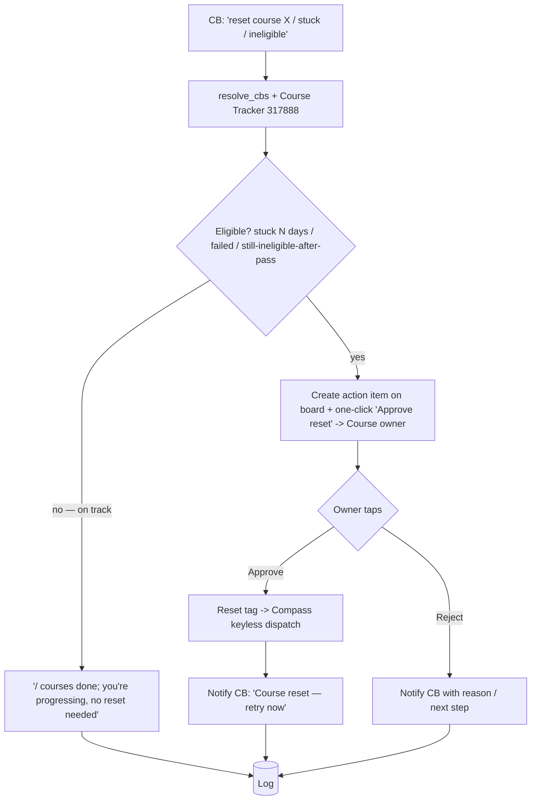
```mermaid
flowchart TD
  A[CB: 'reset course X / stuck / ineligible'] --> B["resolve_cbs + Course Tracker 317888"]
  B --> C{Eligible? stuck N days / failed / still-ineligible-after-pass}
  C -->|no — on track| D["'<x>/<y> courses done; you're progressing, no reset needed'"]
  C -->|yes| E["Create action item on board + one-click 'Approve reset' -> Course owner"]
  E --> F{Owner taps}
  F -->|Approve| G["Reset tag -> Compass keyless dispatch"] --> H["Notify CB: 'Course reset — retry now'"]
  F -->|Reject| I["Notify CB with reason / next step"]
  D --> Z[(Log)]
  H --> Z
  I --> Z
```

### B2 · Tier upgrade (T2→T3)
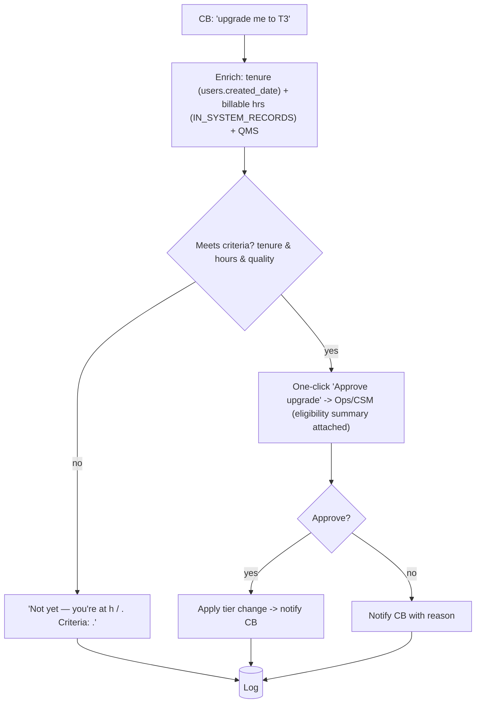
```mermaid
flowchart TD
  A[CB: 'upgrade me to T3'] --> B["Enrich: tenure (users.created_date) + billable hrs (IN_SYSTEM_RECORDS) + QMS"]
  B --> C{Meets criteria? tenure & hours & quality}
  C -->|no| D["'Not yet — you're at <hrs>h / <qms>. Criteria: <thresholds>.'"]
  C -->|yes| E["One-click 'Approve upgrade' -> Ops/CSM (eligibility summary attached)"]
  E --> F{Approve?}
  F -->|yes| G[Apply tier change -> notify CB]
  F -->|no| H[Notify CB with reason]
  D --> Z[(Log)]
  G --> Z
  H --> Z
```

### B3 · Leave request  *(auto-approve when clean, one-click on edge)*
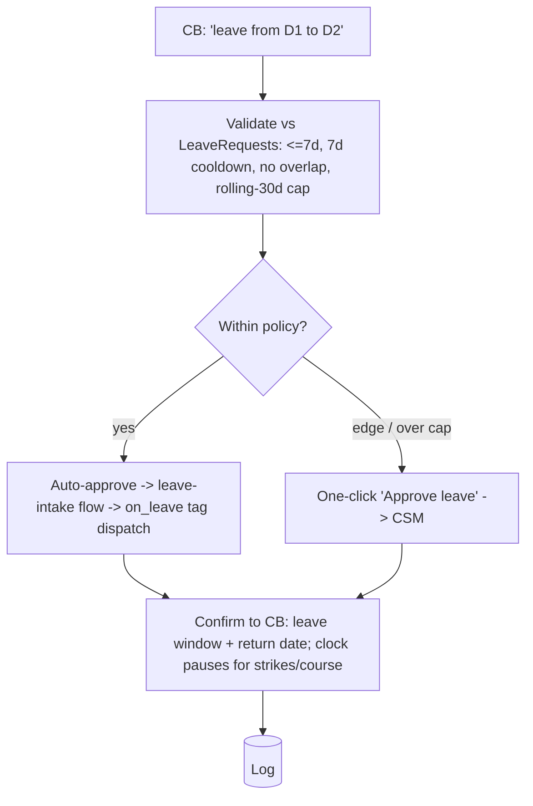
```mermaid
flowchart TD
  A[CB: 'leave from D1 to D2'] --> B["Validate vs LeaveRequests: <=7d, 7d cooldown, no overlap, rolling-30d cap"]
  B --> C{Within policy?}
  C -->|yes| D[Auto-approve -> leave-intake flow -> on_leave tag dispatch]
  C -->|edge / over cap| E[One-click 'Approve leave' -> CSM]
  D --> F["Confirm to CB: leave window + return date; clock pauses for strikes/course"]
  E --> F
  F --> Z[(Log)]
```

### B4 · Early return from leave
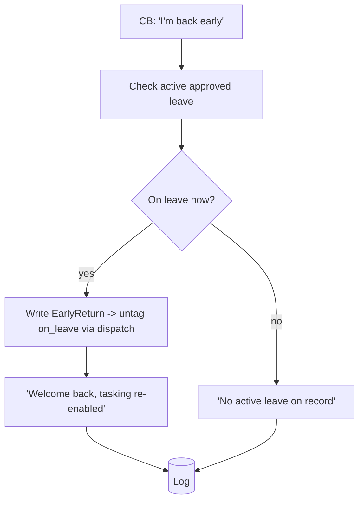
```mermaid
flowchart TD
  A[CB: 'I'm back early'] --> B[Check active approved leave]
  B --> C{On leave now?}
  C -->|yes| D[Write EarlyReturn -> untag on_leave via dispatch] --> E["'Welcome back, tasking re-enabled'"]
  C -->|no| F["'No active leave on record'"]
  E --> Z[(Log)]
  F --> Z
```

---

## C — Batch bucket (allocation team bulk-resolves)

### C1 · EQ / allocation + move-to-marketplace  *(the volume driver)*
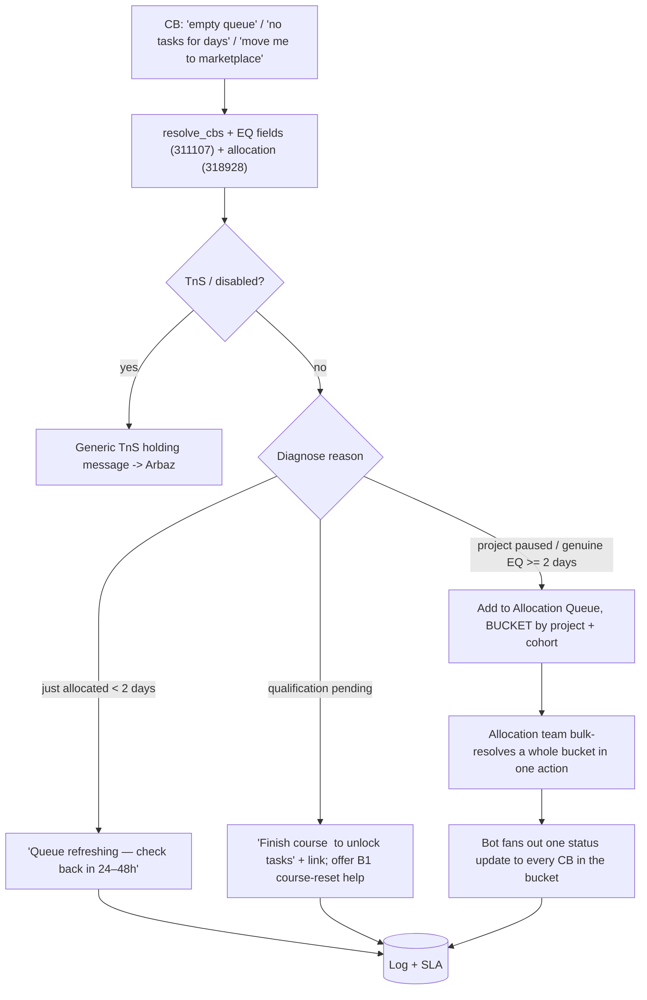
```mermaid
flowchart TD
  A["CB: 'empty queue' / 'no tasks for days' / 'move me to marketplace'"] --> B["resolve_cbs + EQ fields (311107) + allocation (318928)"]
  B --> C{TnS / disabled?}
  C -->|yes| T[Generic TnS holding message -> Arbaz]
  C -->|no| D{Diagnose reason}
  D -->|just allocated < 2 days| E["'Queue refreshing — check back in 24–48h'"]
  D -->|qualification pending| F["'Finish course <X> to unlock tasks' + link; offer B1 course-reset help"]
  D -->|project paused / genuine EQ >= 2 days| G["Add to Allocation Queue, BUCKET by project + cohort"]
  G --> H["Allocation team bulk-resolves a whole bucket in one action"]
  H --> I["Bot fans out one status update to every CB in the bucket"]
  E --> Z[(Log + SLA)]
  F --> Z
  I --> Z
```
> **Bucketing rule (reuse strike system):** "genuine vs transient" EQ = the existing `days_in_eq_7d >= 2` threshold; below that, transient → instant answer (E).

---

## D — Human escalation (named owner; guarded holding message)

### D1 · TnS / account suspended-deactivated  *(reason shielded)*
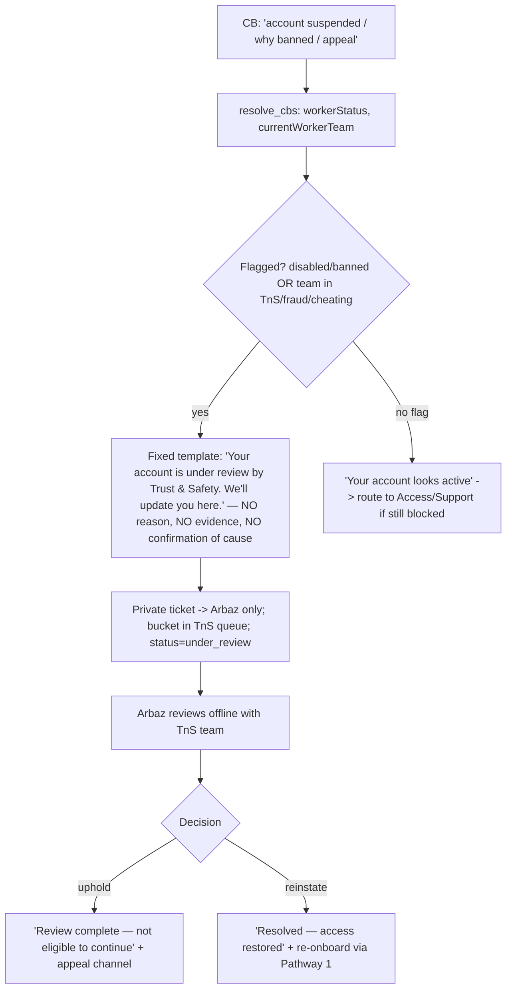
```mermaid
flowchart TD
  A["CB: 'account suspended / why banned / appeal'"] --> B["resolve_cbs: workerStatus, currentWorkerTeam"]
  B --> C{Flagged? disabled/banned OR team in TnS/fraud/cheating}
  C -->|yes| D["Fixed template: 'Your account is under review by Trust & Safety. We'll update you here.' — NO reason, NO evidence, NO confirmation of cause"]
  D --> E["Private ticket -> Arbaz only; bucket in TnS queue; status=under_review"]
  E --> F[Arbaz reviews offline with TnS team]
  F --> G{Decision}
  G -->|uphold| H["'Review complete — not eligible to continue' + appeal channel"]
  G -->|reinstate| I["'Resolved — access restored' + re-onboard via Pathway 1"]
  C -->|no flag| J["'Your account looks active' -> route to Access/Support if still blocked"]
```
> **Guardrails:** all CB-facing TnS copy is fixed templates; follow-ups get the same holding message + ETA until Arbaz updates the ticket. The bot never reveals policy/evidence/strike-reason, nor even whether TnS is the cause.

### D2 · Account verification / access
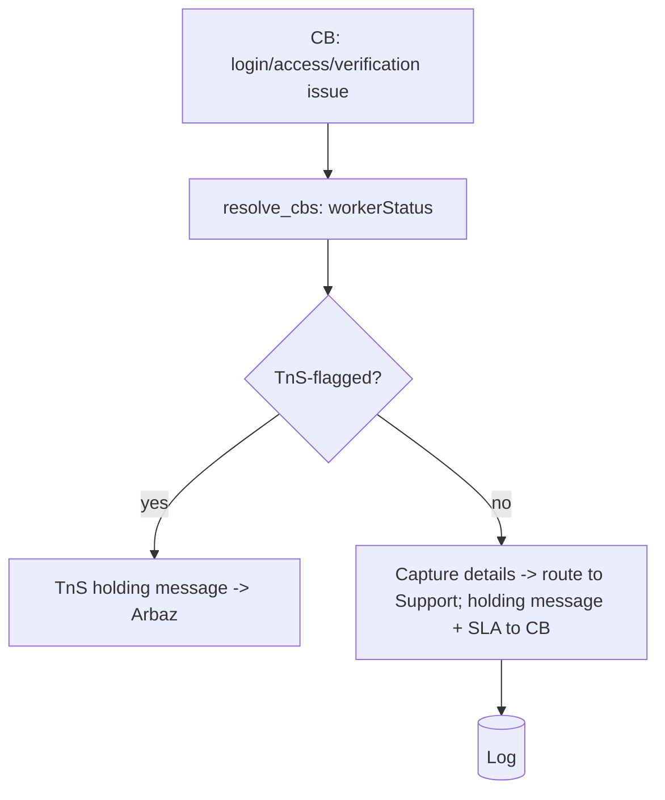
```mermaid
flowchart TD
  A[CB: login/access/verification issue] --> B["resolve_cbs: workerStatus"]
  B --> C{TnS-flagged?}
  C -->|yes| T[TnS holding message -> Arbaz]
  C -->|no| D[Capture details -> route to Support; holding message + SLA to CB]
  D --> Z[(Log)]
```

### D3 · Glitch / bug / data issue
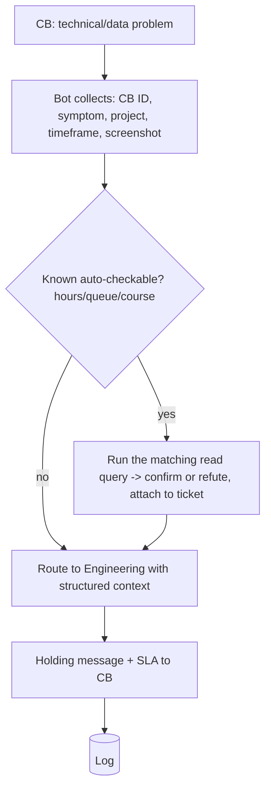
```mermaid
flowchart TD
  A[CB: technical/data problem] --> B[Bot collects: CB ID, symptom, project, timeframe, screenshot]
  B --> C{Known auto-checkable? hours/queue/course}
  C -->|yes| D[Run the matching read query -> confirm or refute, attach to ticket]
  C -->|no| E[Route to Engineering with structured context]
  D --> E
  E --> F[Holding message + SLA to CB]
  F --> Z[(Log)]
```

### D4 · Re-onboarding ("can I rejoin INQA?")
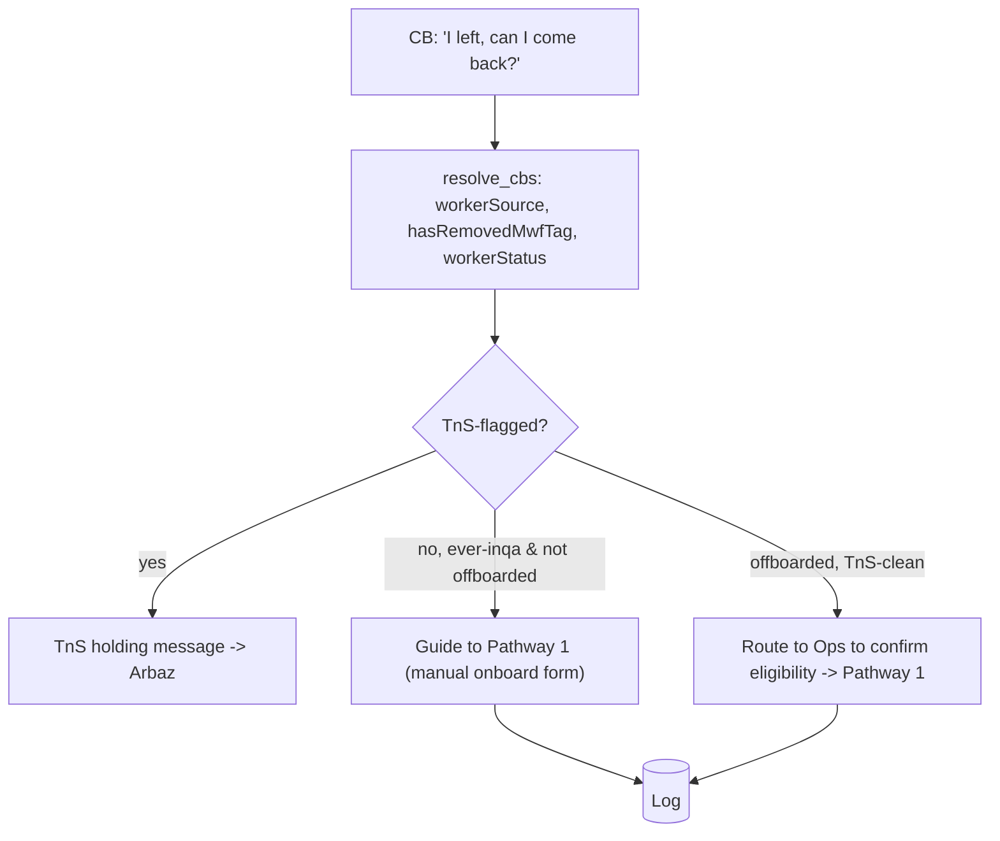
```mermaid
flowchart TD
  A[CB: 'I left, can I come back?'] --> B["resolve_cbs: workerSource, hasRemovedMwfTag, workerStatus"]
  B --> C{TnS-flagged?}
  C -->|yes| T[TnS holding message -> Arbaz]
  C -->|no, ever-inqa & not offboarded| D["Guide to Pathway 1 (manual onboard form)"]
  C -->|offboarded, TnS-clean| E[Route to Ops to confirm eligibility -> Pathway 1]
  D --> Z[(Log)]
  E --> Z
```

---

## Classifier — "Others" (46.9%) and ambiguity

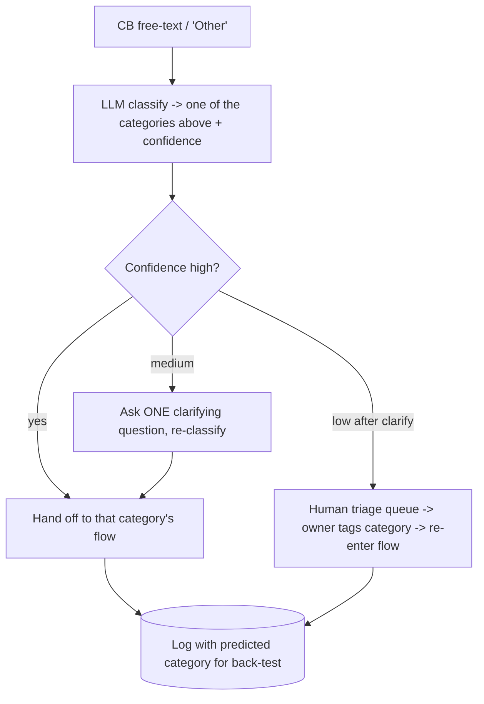
```mermaid
flowchart TD
  A[CB free-text / 'Other'] --> B[LLM classify -> one of the categories above + confidence]
  B --> C{Confidence high?}
  C -->|yes| D[Hand off to that category's flow]
  C -->|medium| E[Ask ONE clarifying question, re-classify]
  C -->|low after clarify| F[Human triage queue -> owner tags category -> re-enter flow]
  D --> Z[(Log with predicted category for back-test)]
  E --> D
  F --> Z
```

---

## Cross-cutting rules (apply to all flows)

- **TnS shield first** — the canonical invariant, on every flow.
- **Identity once** — resolve `outlier_id` at intake; cache for the thread.
- **One ticket record per interaction** — even instant answers are logged (analytics + dedup + classifier back-test labels).
- **Status cadence** — acknowledge immediately; for B/C/D, post an SLA-based holding message and update on state change; close with a one-tap CSAT.
- **Follow-ups stay in-thread** — bot keeps context; repeated asks don't create duplicate tickets (dedup on open ticket for same CB + category).
- **Read live, not the mirror** — for real-time answers query LeaveRequests / Strikes / `resolve_cbs`, not the daily-synced INQA CBs table.

---

## Category → tool/data map

| Category | Tool / query | Returns |
|----------|--------------|---------|
| EQ status / why | `resolve_cbs` + 311107 EQ fields + 318928 | days_in_eq, allocation layers, qual gate |
| Course status / reset | Course Tracker **317888** | courses passed/unfinished, days_in_course, next course |
| Account / allocation / tier | `resolve_cbs` (keyless) + 318928 | workerSource, workerStatus, team, project, tier |
| Profile skills (read-only) | skills/qualifications query *(confirm source: Snowflake skills field / qualificationentries / Worker Skill Dictionary)* | current skill list; Coding + Computer Science → most coding projects |
| TnS flag (existence only) | `resolve_cbs` workerStatus/team | disabled/banned/TnS-team → boolean (no detail) |
| Tier-upgrade eligibility | `IN_SYSTEM_RECORDS` hrs + `users.created_date` + QMS | billable hours, real tenure, quality |
| Strike / cooldown | Airtable **Strikes** / **PendingStrikes** | level, category, cooldown_until, metric |
| Leave status | Airtable **LeaveRequests** + on_leave tag | status, end_date, early-return |
| Task availability | Redash queue read | tasks present in project? |

---

## Open items to confirm with the team

- **Platform**: Slack-native vs **Linear-centric** vs Airtable-backed — flows are ready for any; pick after this walkthrough.
- Owner Slack/Linear handles per category.
- **Profile-skills data source** for A5 + exact "Coding + Computer Science → eligible" rule wording.
- Tier-upgrade write path — Compass card vs. new cookie-backed CorpApi endpoint vs. one-click-then-human-does-it.
- EQ "transient vs genuine" threshold — reuse `days_in_eq_7d >= 2` or a new SLA.
- Intake UX — free-text (LLM classifies) vs. slash-command / Linear template with a category dropdown.
